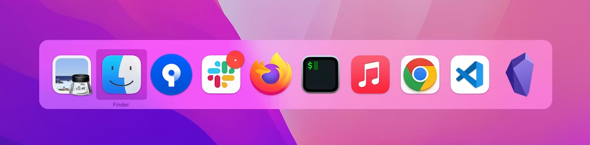

# CmdTabReopener

Reopen closed or minimized app windows via `Cmd+Tab` on macOS — no
permissions needed.

## Install

Download the latest [release](https://github.com/pedroydzito/mac-cmdtabreopener/releases/latest),
unzip it, then double-click **`Activate.command`**. To remove it,
double-click **`Deactivate.command`**.

Note: it won't reopen an app if you close its last window and
immediately `Cmd+Tab` right back to it without switching to any other
app first — that's intentional. macOS still reports that app as
"active" in that case since no real switch happened, so there's no
reliable signal to react to. An earlier version tried to detect and fix
this anyway, but it ended up mistaking apps' normal resting state
(zero windows open) for "stuck," which caused a feedback loop that made
the Mac unusable. Not worth the risk for an edge case that rarely comes
up in practice.
